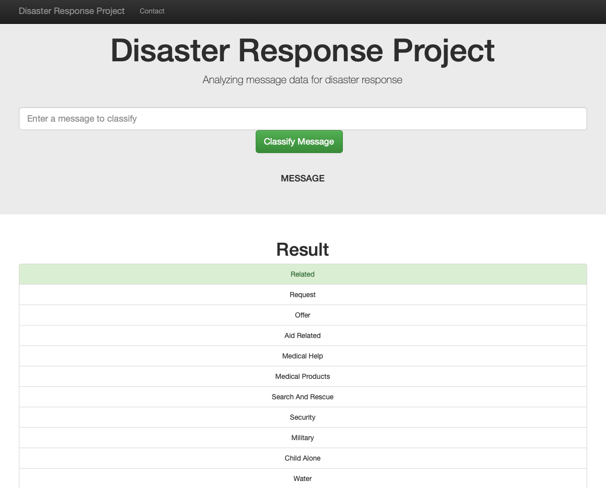

# Disaster Response

A machine learning pipeline to categorize emergency messages based on the needs communicated by the sender.

## Dependencies

* Python 3.7+
* ETL: NumPy, Pandas, SQLalchemy
* Feature engineering: NLTK
* ML: Scikit-Learn
* Model Ex: Pickle
* Web App and Data Visualization: Flask, Plotly

## Execute

1. Clone the git repository:

`git clone https://github.com/gabrieltempass/disaster-response.git`

2. Go to the project's directory.
3. Prepare the database, with the command:

`python data/process_data.py data/disaster_messages.csv data/disaster_categories.csv data/disaster_response.db`

4. Train, evaluate and save the model, with the command:

`python models/train_classifier.py data/disaster_response.db models/model.pickle`

5. Open the web app, with the command:

`python app/run.py`

6. Open a tab in a web browser, type `localhost:3001` in the address bar and hit enter.

## Notebooks

In the notebooks folder there are two jupyter notebooks that show how the ETL and the ML is done.

## Dataset

The original dataset was provided by Appen and can be found here:
https://appen.com/datasets/combined-disaster-response-data/
